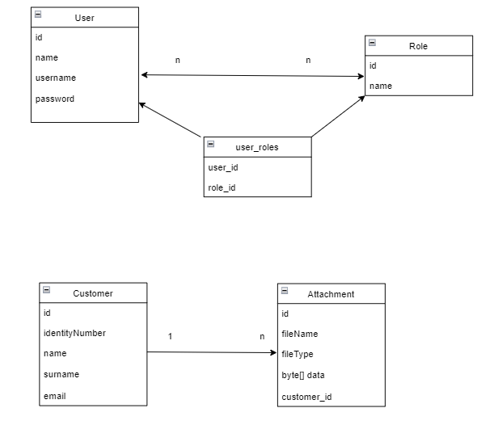
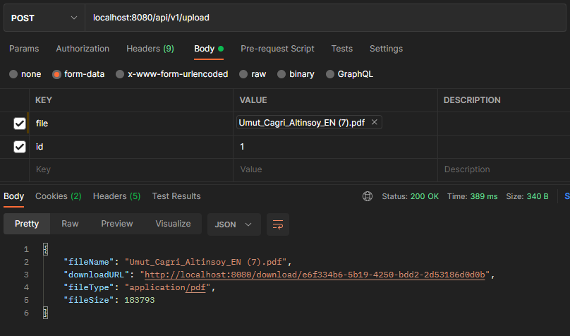
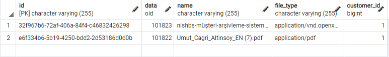

# Customer Archive System

### API USAGE

## Customer Controller

```http
   localhost:8080/api/v1
```

| HTTP | URL                          | Explanation                |
| :-------- |:-----------------------------| :------------------------- |
| `GET` | `/customers`                 | **Get all customers**. |
| `POST` | `/customer`                  | **Save customer**. |
| `PUT` | `/customer/{identityNumber}` | **Update customer with given identity number**. |
| `DELETE` | `/customer/{identityNumber}` | **Delete customer with given identity number**. |
| `GET` | `/customer{identityNumber}`                | **Get customer with given identity number**. |

## User Controller

```http
   localhost:8080/api/v1
```

| HTTP  | URL               | Explanation                    |
|:------|:------------------|:-------------------------------|
| `GET` | `/users`          | **Get all users**.             |
| `POST` | `/user/save`      | **Save user**.                 |
| `POST` | `/role/save`      | **Save role**.                 |
| `POST` | `/role/addToUser` | **Assign a role to the user**. |

## Attachment Controller

```http
   localhost:8080/api/v1
```

| HTTP     | URL                  | Explanation                      |
|:---------|:---------------------|:---------------------------------|
| `POST`   | `/upload`            | **Upload an attachment**.        |
| `GET`    | `/getAllFiles`       | **Get all files from DB**.       |
| `GET`    | `/files/{id}`        | **Get files for specific user**. |
| `POST`   | `/download/{fileId}` | **Download file.**.              |
| `DELETE` | `/delete/{fileId}`   | **Delete a file.**.              |

## Entity Relationship Diagram




### Upload File with User




## Tech Stack
* JDK 11
* Spring Boot
* Spring Data JPA
* Security(Disabled)
* PostgreSql
* Docker
* Open API / Swagger


